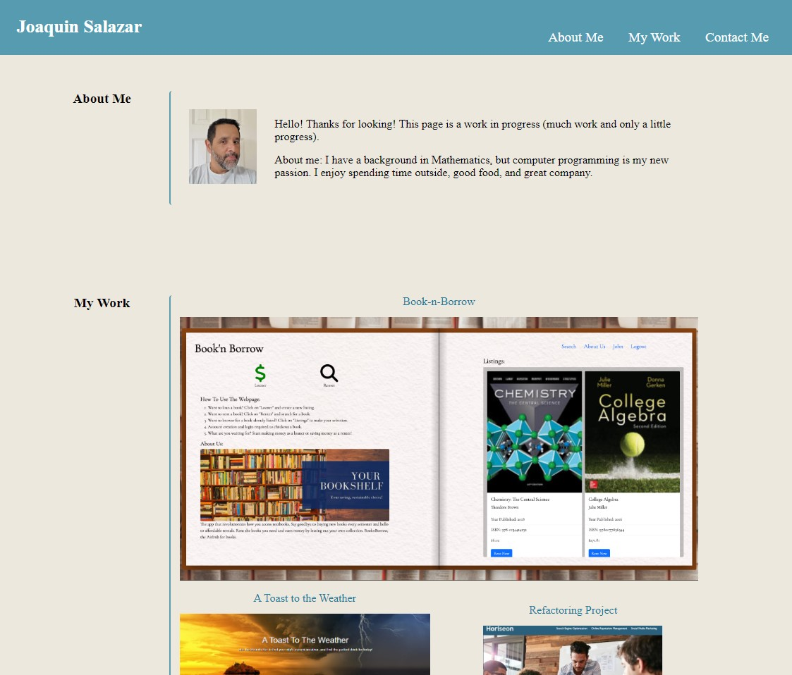

# 1st-Portfolio-Project
weekly-challenge-2

# Description
This repository serves as the portfolio for owner/author Joaquin Salazar. The portfolio highlights strengths, progress, and serves as an ongoing receptacle for growth.

## Usage

https://joaqsala.github.io/2-weekly-challenge/

The webpage provides potential employers (and other programers) with a choice catalog of finished projects. Peruse at your leisure.

## Credits

To the many others who have guided and cheered me on - a toast!

## License

Please refer to LICENSE in repo.
